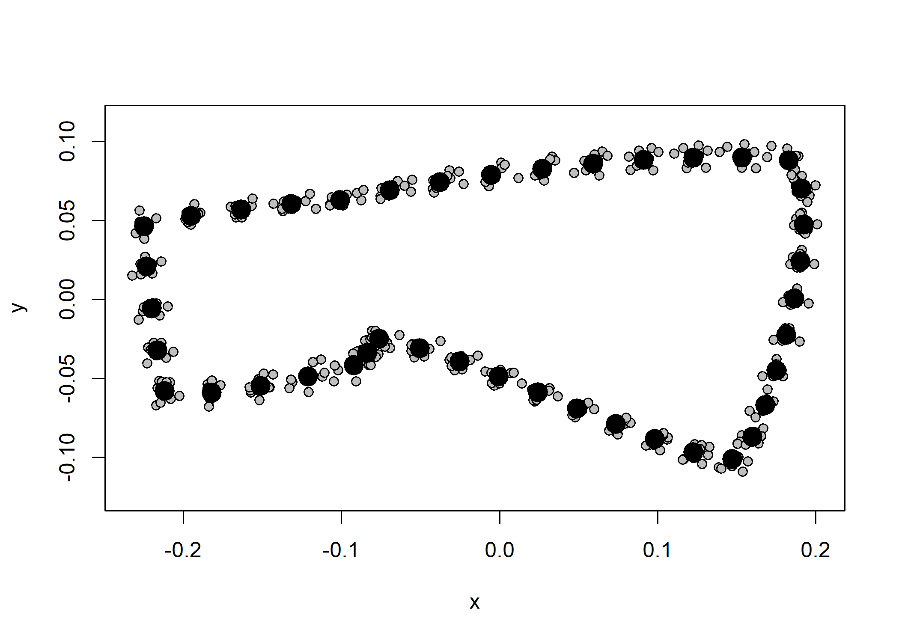
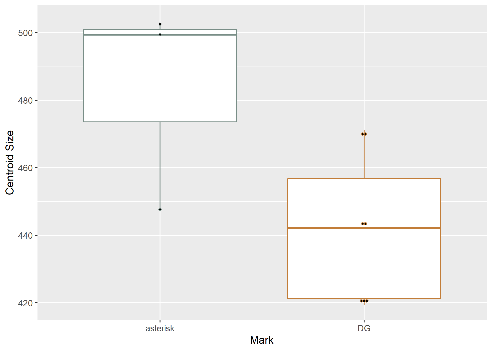
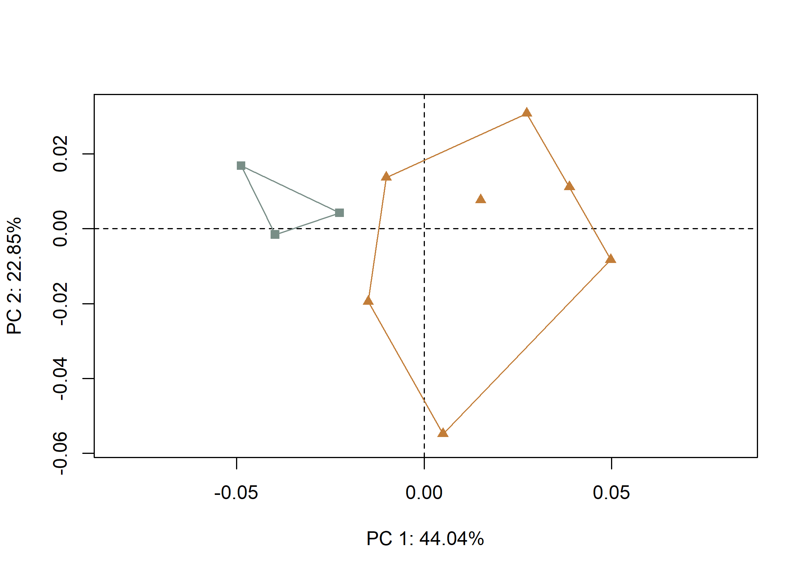
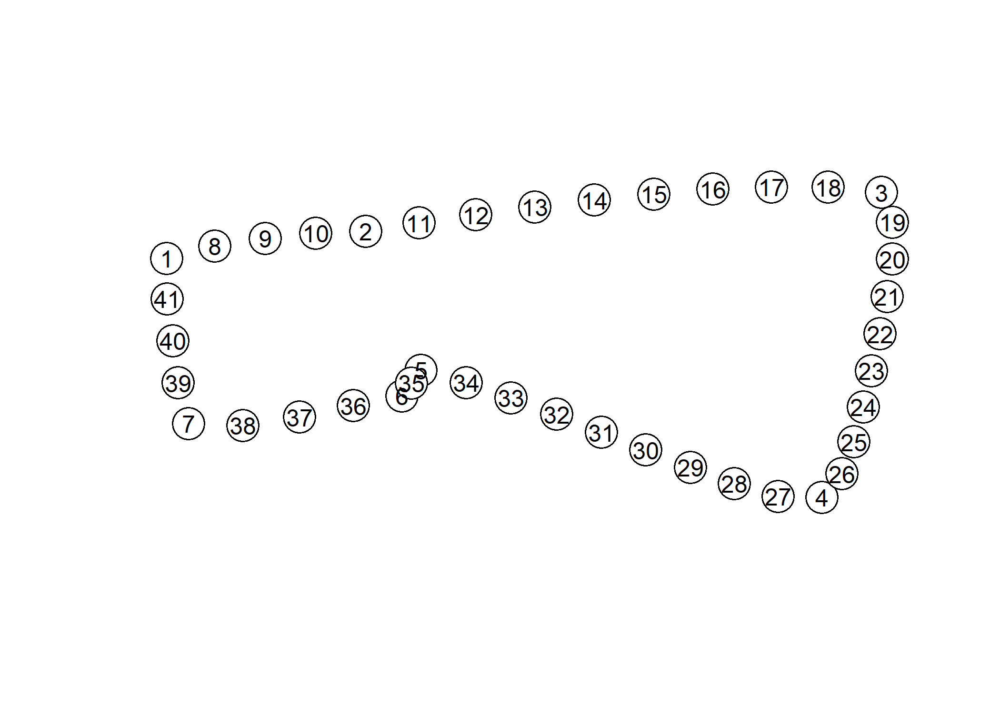
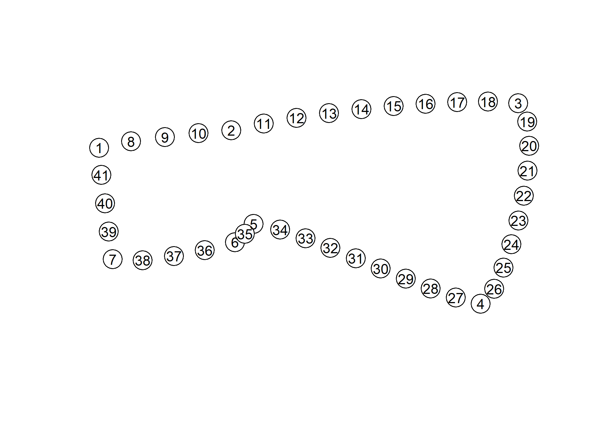
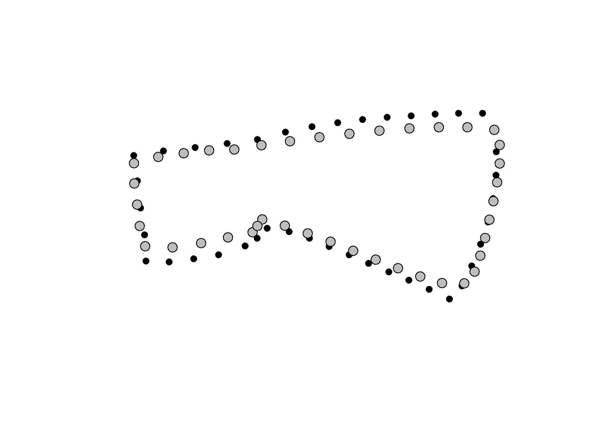

Supplementary materials for paper: French trade axes from the La Belle
shipwreck demonstrate significant morphological differences by makers’
mark
================
Robert Z. Selden, Jr.
19 February, 2021

## Load packages

``` r
#devtools::install_github("geomorphR/geomorph", ref = "Stable", build_vignettes = TRUE)
library(here)
```

    ## here() starts at D:/github/fta3dgm

``` r
library(StereoMorph)
library(geomorph)
```

    ## Loading required package: RRPP

    ## Loading required package: rgl

``` r
library(tidyverse)
```

    ## -- Attaching packages --------------------------------------- tidyverse 1.3.0 --

    ## v ggplot2 3.3.3     v purrr   0.3.4
    ## v tibble  3.0.6     v dplyr   1.0.4
    ## v tidyr   1.1.2     v stringr 1.4.0
    ## v readr   1.4.0     v forcats 0.5.1

    ## -- Conflicts ------------------------------------------ tidyverse_conflicts() --
    ## x dplyr::filter() masks stats::filter()
    ## x dplyr::lag()    masks stats::lag()

``` r
library(wesanderson)
```

## Generalised Procrustes Analysis

Landmark data were aligned to a global coordinate system (Kendall 1981,
1984; Slice 2001), achieved through generalised Procrustes
superimposition (Rohlf and Slice 1990) performed in R 4.0.4 (R Core
Development Team, 2021) using the `geomorph` library v. 3.3.2 (Adams et
al. 2017; Adams and Otárola-Castillo 2013). Procrustes superimposition
translates, scales, and rotates the coordinate data to allow for
comparisons among objects (Gower 1975; Rohlf and Slice 1990). The
`geomorph` package uses a partial Procrustes superimposition that
projects the aligned specimens into tangent space subsequent to
alignment in preparation for the use of multivariate methods that assume
linear space (Rohlf 1999; Slice 2001).

``` r
# gpa ----
Y.gpa <- gpagen(coords, print.progress = FALSE)
plot(Y.gpa)
```



``` r
# geomorph data frame ----
gdf <- geomorph.data.frame(shape = Y.gpa$coords, 
                           size = Y.gpa$Csize,
                           mark = qdata$mark)

# add centroid size to qdata ----
qdata$csz <- Y.gpa$Csize

# print qdata
knitr::kable(qdata, align = "lccc", caption = "Attributes included in qdata.")
```

|            | cask  |   mark   |   csz    |
|:-----------|:------|:--------:|:--------:|
| 11373-2.20 | 11373 | asterisk | 447.6635 |
| 11373-2.21 | 11373 | asterisk | 499.3537 |
| 11373-2.23 | 11373 |    DG    | 421.9203 |
| 11373-2.28 | 11373 | asterisk | 502.4541 |
| 11375-2.3  | 11375 |    DG    | 444.6668 |
| 11375-2.40 | 11375 |    DG    | 442.0828 |
| 11375-2.45 | 11375 |    DG    | 468.6789 |
| 11411-2.10 | 11411 |    DG    | 471.1334 |
| 11411-2.24 | 11411 |    DG    | 419.2457 |
| 11411-2.29 | 11411 |    DG    | 420.7324 |

Attributes included in qdata.

### Variation in French trade axe size by mark

``` r
# attributes for boxplots ----
csz <- qdata$csz # centroid size
cask <- qdata$cask # cask
mark <- qdata$mark  # mark

# boxplot of axe centroid size by mark ----
csz.mark <- ggplot(qdata, aes(x = mark, y = csz, color = mark)) + 
  geom_boxplot() +
  geom_dotplot(binaxis = 'y', stackdir = 'center', dotsize = 0.3) +
  scale_colour_manual(values = wes_palette("Moonrise2")) +
  theme(legend.position = "none") +
  labs(x = 'Mark', y = 'Centroid Size')
# render plot
csz.mark
```

    ## `stat_bindot()` using `bins = 30`. Pick better value with `binwidth`.



## Principal Components Analysis

Principal components analysis (Jolliffe 2002) was used to visualise
shape variation among the axes The shape changes described by each
principal axis are commonly visualized using thin-plate spline warping
of a reference 3D mesh (Klingenberg 2013; Sherratt et al. 2014).

``` r
# principal components analysis
pca<-gm.prcomp(Y.gpa$coords)
summary(pca)
```

    ## 
    ## Ordination type: Principal Component Analysis 
    ## Centering by OLS mean
    ## Orthogonal projection of OLS residuals
    ## Number of observations: 10 
    ## Number of vectors 10 
    ## 
    ## Importance of Components:
    ##                              Comp1        Comp2        Comp3       Comp4
    ## Eigenvalues            0.001084624 0.0005626922 0.0004136056 0.000148572
    ## Proportion of Variance 0.440390185 0.2284700993 0.1679364081 0.060324744
    ## Cumulative Proportion  0.440390185 0.6688602842 0.8367966923 0.897121436
    ##                               Comp5        Comp6        Comp7        Comp8
    ## Eigenvalues            0.0001221042 6.503468e-05 3.613184e-05 1.866069e-05
    ## Proportion of Variance 0.0495780200 2.640605e-02 1.467062e-02 7.576807e-03
    ## Cumulative Proportion  0.9466994558 9.731055e-01 9.877761e-01 9.953529e-01
    ##                               Comp9       Comp10
    ## Eigenvalues            1.144512e-05 1.828701e-33
    ## Proportion of Variance 4.647064e-03 7.425079e-31
    ## Cumulative Proportion  1.000000e+00 1.000000e+00

``` r
# set plot parameters to plot by mark
pch.gps <- c(15,17)[as.factor(mark)]
col.gps <- wes_palette("Moonrise2")[as.factor(mark)]
col.hull <- c("#798E87","#C27D38")

# plot pca by mark
pc.plot1 <- plot(pca, 
                 asp = 1,
                 pch = pch.gps,
                 col = col.gps)
shapeHulls(pc.plot1, 
           groups = mark,
           group.cols = col.hull)
```



``` r
# print pca with warp grids at max/min X and max/min Y
knitr::include_graphics('./figures/pca.warp.jpg')
```


## Test hypothesis

*Hypothesis: There are morphological differences between French trade
axes that bear an asterisk or DG makers’ marks.*

``` r
# size as a function of mark ----
fit.size.mark <- procD.lm(size ~ mark, 
                          data = gdf, 
                          print.progress = FALSE, 
                          iter = 9999)

## differences in size by mark?
anova(fit.size.mark)
```

    ## 
    ## Analysis of Variance, using Residual Randomization
    ## Permutation procedure: Randomization of null model residuals 
    ## Number of permutations: 10000 
    ## Estimation method: Ordinary Least Squares 
    ## Sums of Squares and Cross-products: Type I 
    ## Effect sizes (Z) based on F distributions
    ## 
    ##           Df     SS     MS    Rsq      F      Z Pr(>F)  
    ## mark       1 3695.3 3695.3 0.4334 6.1193 1.6529 0.0252 *
    ## Residuals  8 4831.0  603.9 0.5666                       
    ## Total      9 8526.3                                     
    ## ---
    ## Signif. codes:  0 '***' 0.001 '**' 0.01 '*' 0.05 '.' 0.1 ' ' 1
    ## 
    ## Call: procD.lm(f1 = size ~ mark, iter = 9999, data = gdf, print.progress = FALSE)

``` r
# shape as a function of mark ----
fit.shape.mark <- procD.lm(shape ~ mark, 
                           data = gdf, 
                           print.progress = FALSE, 
                           iter = 9999)

## differences in shape by mark? ----
anova(fit.shape.mark)
```

    ## 
    ## Analysis of Variance, using Residual Randomization
    ## Permutation procedure: Randomization of null model residuals 
    ## Number of permutations: 10000 
    ## Estimation method: Ordinary Least Squares 
    ## Sums of Squares and Cross-products: Type I 
    ## Effect sizes (Z) based on F distributions
    ## 
    ##           Df        SS        MS     Rsq      F      Z  Pr(>F)  
    ## mark       1 0.0061494 0.0061494 0.27742 3.0715 2.1072 0.01425 *
    ## Residuals  8 0.0160165 0.0020021 0.72258                        
    ## Total      9 0.0221658                                          
    ## ---
    ## Signif. codes:  0 '***' 0.001 '**' 0.01 '*' 0.05 '.' 0.1 ' ' 1
    ## 
    ## Call: procD.lm(f1 = shape ~ mark, iter = 9999, data = gdf, print.progress = FALSE)

### Morphological disparity

``` r
# does one of the groups display greater shape variation among individuals 
# relative to the other group?
morphol.disparity(shape ~ mark, 
                  groups = qdata$mark, 
                  data = gdf, 
                  print.progress = FALSE, 
                  iter = 9999)
```

    ## 
    ## Call:
    ## morphol.disparity(f1 = shape ~ mark, groups = qdata$mark, iter = 9999,  
    ##     data = gdf, print.progress = FALSE) 
    ## 
    ## 
    ## 
    ## Randomized Residual Permutation Procedure Used
    ## 10000 Permutations
    ## 
    ## Procrustes variances for defined groups
    ##     asterisk           DG 
    ## 0.0007308991 0.0019748264 
    ## 
    ## 
    ## Pairwise absolute differences between variances
    ##             asterisk          DG
    ## asterisk 0.000000000 0.001243927
    ## DG       0.001243927 0.000000000
    ## 
    ## 
    ## P-Values
    ##          asterisk     DG
    ## asterisk   1.0000 0.0242
    ## DG         0.0242 1.0000

### Mean shapes

``` r
# mean shapes ----
new.coords<-coords.subset(A = Y.gpa$coords, 
                          group = qdata$mark)
names(new.coords)
```

    ## [1] "asterisk" "DG"

``` r
# group shape means
mean <- lapply(new.coords, mshape)

# plot mean shapes
plot(mean$asterisk) # mean shape for axes with asterisk mark
```



``` r
plot(mean$DG) # mean shape for axes with DG mark
```



``` r
# comparison plot of French trade axes bearing asterisk (gray) 
# and DG (black) marks
plotRefToTarget(mean$asterisk, 
                mean$DG, 
                method = "point",
                mag = 2)
```



### Colophon

This version of the analysis was generated on 2021-02-19 03:02:09 using
the following computational environment and dependencies:

``` r
# what R packages and versions were used?
if ("devtools" %in% installed.packages()) devtools::session_info()
```

    ## - Session info ---------------------------------------------------------------
    ##  setting  value                       
    ##  version  R version 4.0.4 (2021-02-15)
    ##  os       Windows 10 x64              
    ##  system   x86_64, mingw32             
    ##  ui       RTerm                       
    ##  language (EN)                        
    ##  collate  English_United States.1252  
    ##  ctype    English_United States.1252  
    ##  tz       America/Chicago             
    ##  date     2021-02-19                  
    ## 
    ## - Packages -------------------------------------------------------------------
    ##  package          * version  date       lib source                             
    ##  ape                5.4-1    2020-08-13 [1] CRAN (R 4.0.2)                     
    ##  assertthat         0.2.1    2019-03-21 [1] CRAN (R 4.0.2)                     
    ##  backports          1.2.1    2020-12-09 [1] CRAN (R 4.0.3)                     
    ##  bezier             1.1.2    2018-12-14 [1] CRAN (R 4.0.3)                     
    ##  brew               1.0-6    2011-04-13 [1] CRAN (R 4.0.0)                     
    ##  broom              0.7.4    2021-01-29 [1] CRAN (R 4.0.3)                     
    ##  cachem             1.0.3    2021-02-04 [1] CRAN (R 4.0.3)                     
    ##  callr              3.5.1    2020-10-13 [1] CRAN (R 4.0.3)                     
    ##  cellranger         1.1.0    2016-07-27 [1] CRAN (R 4.0.2)                     
    ##  cli                2.3.0    2021-01-31 [1] CRAN (R 4.0.3)                     
    ##  colorspace         2.0-0    2020-11-11 [1] CRAN (R 4.0.3)                     
    ##  crayon             1.4.1    2021-02-08 [1] CRAN (R 4.0.3)                     
    ##  crosstalk          1.1.1    2021-01-12 [1] CRAN (R 4.0.3)                     
    ##  DBI                1.1.1    2021-01-15 [1] CRAN (R 4.0.3)                     
    ##  dbplyr             2.1.0    2021-02-03 [1] CRAN (R 4.0.3)                     
    ##  desc               1.2.0    2018-05-01 [1] CRAN (R 4.0.2)                     
    ##  devtools           2.3.2    2020-09-18 [1] CRAN (R 4.0.2)                     
    ##  digest             0.6.27   2020-10-24 [1] CRAN (R 4.0.3)                     
    ##  dplyr            * 1.0.4    2021-02-02 [1] CRAN (R 4.0.3)                     
    ##  ellipsis           0.3.1    2020-05-15 [1] CRAN (R 4.0.2)                     
    ##  evaluate           0.14     2019-05-28 [1] CRAN (R 4.0.2)                     
    ##  farver             2.0.3    2020-01-16 [1] CRAN (R 4.0.2)                     
    ##  fastmap            1.1.0    2021-01-25 [1] CRAN (R 4.0.3)                     
    ##  forcats          * 0.5.1    2021-01-27 [1] CRAN (R 4.0.3)                     
    ##  fs                 1.5.0    2020-07-31 [1] CRAN (R 4.0.2)                     
    ##  generics           0.1.0    2020-10-31 [1] CRAN (R 4.0.3)                     
    ##  geomorph         * 3.3.2    2021-01-23 [1] Github (geomorphR/geomorph@788ab5b)
    ##  ggplot2          * 3.3.3    2020-12-30 [1] CRAN (R 4.0.3)                     
    ##  glue               1.4.2    2020-08-27 [1] CRAN (R 4.0.2)                     
    ##  gtable             0.3.0    2019-03-25 [1] CRAN (R 4.0.2)                     
    ##  haven              2.3.1    2020-06-01 [1] CRAN (R 4.0.2)                     
    ##  here             * 1.0.1    2020-12-13 [1] CRAN (R 4.0.3)                     
    ##  highr              0.8      2019-03-20 [1] CRAN (R 4.0.2)                     
    ##  hms                1.0.0    2021-01-13 [1] CRAN (R 4.0.3)                     
    ##  htmltools          0.5.1.1  2021-01-22 [1] CRAN (R 4.0.3)                     
    ##  htmlwidgets        1.5.3    2020-12-10 [1] CRAN (R 4.0.3)                     
    ##  httpuv             1.5.5    2021-01-13 [1] CRAN (R 4.0.3)                     
    ##  httr               1.4.2    2020-07-20 [1] CRAN (R 4.0.2)                     
    ##  jpeg               0.1-8.1  2019-10-24 [1] CRAN (R 4.0.0)                     
    ##  jsonlite           1.7.2    2020-12-09 [1] CRAN (R 4.0.3)                     
    ##  knitr              1.31     2021-01-27 [1] CRAN (R 4.0.3)                     
    ##  labeling           0.4.2    2020-10-20 [1] CRAN (R 4.0.3)                     
    ##  later              1.1.0.1  2020-06-05 [1] CRAN (R 4.0.2)                     
    ##  lattice            0.20-41  2020-04-02 [2] CRAN (R 4.0.4)                     
    ##  lifecycle          1.0.0    2021-02-15 [1] CRAN (R 4.0.4)                     
    ##  lubridate          1.7.9.2  2020-11-13 [1] CRAN (R 4.0.3)                     
    ##  magrittr           2.0.1    2020-11-17 [1] CRAN (R 4.0.3)                     
    ##  manipulateWidget   0.10.1   2020-02-24 [1] CRAN (R 4.0.2)                     
    ##  MASS               7.3-53.1 2021-02-12 [1] CRAN (R 4.0.4)                     
    ##  memoise            2.0.0    2021-01-26 [1] CRAN (R 4.0.3)                     
    ##  mime               0.10     2021-02-13 [1] CRAN (R 4.0.4)                     
    ##  miniUI             0.1.1.1  2018-05-18 [1] CRAN (R 4.0.2)                     
    ##  modelr             0.1.8    2020-05-19 [1] CRAN (R 4.0.2)                     
    ##  munsell            0.5.0    2018-06-12 [1] CRAN (R 4.0.2)                     
    ##  nlme               3.1-152  2021-02-04 [2] CRAN (R 4.0.4)                     
    ##  pillar             1.4.7    2020-11-20 [1] CRAN (R 4.0.3)                     
    ##  pkgbuild           1.2.0    2020-12-15 [1] CRAN (R 4.0.3)                     
    ##  pkgconfig          2.0.3    2019-09-22 [1] CRAN (R 4.0.2)                     
    ##  pkgload            1.1.0    2020-05-29 [1] CRAN (R 4.0.2)                     
    ##  png                0.1-7    2013-12-03 [1] CRAN (R 4.0.0)                     
    ##  prettyunits        1.1.1    2020-01-24 [1] CRAN (R 4.0.2)                     
    ##  processx           3.4.5    2020-11-30 [1] CRAN (R 4.0.3)                     
    ##  promises           1.2.0.1  2021-02-11 [1] CRAN (R 4.0.3)                     
    ##  ps                 1.5.0    2020-12-05 [1] CRAN (R 4.0.3)                     
    ##  purrr            * 0.3.4    2020-04-17 [1] CRAN (R 4.0.2)                     
    ##  R6                 2.5.0    2020-10-28 [1] CRAN (R 4.0.3)                     
    ##  Rcpp               1.0.6    2021-01-15 [1] CRAN (R 4.0.3)                     
    ##  readr            * 1.4.0    2020-10-05 [1] CRAN (R 4.0.3)                     
    ##  readxl             1.3.1    2019-03-13 [1] CRAN (R 4.0.2)                     
    ##  remotes            2.2.0    2020-07-21 [1] CRAN (R 4.0.2)                     
    ##  reprex             1.0.0    2021-01-27 [1] CRAN (R 4.0.3)                     
    ##  rgl              * 0.105.13 2021-02-15 [1] CRAN (R 4.0.4)                     
    ##  rjson              0.2.20   2018-06-08 [1] CRAN (R 4.0.0)                     
    ##  rlang              0.4.10   2020-12-30 [1] CRAN (R 4.0.3)                     
    ##  rmarkdown          2.7      2021-02-19 [1] CRAN (R 4.0.4)                     
    ##  Rook               1.1-1    2014-10-20 [1] CRAN (R 4.0.3)                     
    ##  rprojroot          2.0.2    2020-11-15 [1] CRAN (R 4.0.3)                     
    ##  RRPP             * 0.6.2    2021-01-11 [1] CRAN (R 4.0.3)                     
    ##  rstudioapi         0.13     2020-11-12 [1] CRAN (R 4.0.3)                     
    ##  rvest              0.3.6    2020-07-25 [1] CRAN (R 4.0.2)                     
    ##  scales             1.1.1    2020-05-11 [1] CRAN (R 4.0.2)                     
    ##  sessioninfo        1.1.1    2018-11-05 [1] CRAN (R 4.0.2)                     
    ##  shiny              1.6.0    2021-01-25 [1] CRAN (R 4.0.3)                     
    ##  StereoMorph      * 1.6.3    2019-11-30 [1] CRAN (R 4.0.3)                     
    ##  stringi            1.5.3    2020-09-09 [1] CRAN (R 4.0.2)                     
    ##  stringr          * 1.4.0    2019-02-10 [1] CRAN (R 4.0.2)                     
    ##  svgViewR           1.4.1    2020-10-03 [1] CRAN (R 4.0.3)                     
    ##  testthat           3.0.2    2021-02-14 [1] CRAN (R 4.0.4)                     
    ##  tibble           * 3.0.6    2021-01-29 [1] CRAN (R 4.0.3)                     
    ##  tidyr            * 1.1.2    2020-08-27 [1] CRAN (R 4.0.2)                     
    ##  tidyselect         1.1.0    2020-05-11 [1] CRAN (R 4.0.2)                     
    ##  tidyverse        * 1.3.0    2019-11-21 [1] CRAN (R 4.0.2)                     
    ##  tiff               0.1-6    2020-11-17 [1] CRAN (R 4.0.3)                     
    ##  usethis            2.0.1    2021-02-10 [1] CRAN (R 4.0.3)                     
    ##  vctrs              0.3.6    2020-12-17 [1] CRAN (R 4.0.3)                     
    ##  webshot            0.5.2    2019-11-22 [1] CRAN (R 4.0.2)                     
    ##  wesanderson      * 0.3.6    2018-04-20 [1] CRAN (R 4.0.2)                     
    ##  withr              2.4.1    2021-01-26 [1] CRAN (R 4.0.3)                     
    ##  xfun               0.21     2021-02-10 [1] CRAN (R 4.0.3)                     
    ##  xml2               1.3.2    2020-04-23 [1] CRAN (R 4.0.2)                     
    ##  xtable             1.8-4    2019-04-21 [1] CRAN (R 4.0.2)                     
    ##  yaml               2.2.1    2020-02-01 [1] CRAN (R 4.0.0)                     
    ## 
    ## [1] C:/Users/seldenjrz/Documents/R/win-library/4.0
    ## [2] C:/Program Files/R/R-4.0.4/library

Current Git commit details are:

``` r
# where can I find this commit? 
if ("git2r" %in% installed.packages() & git2r::in_repository(path = ".")) git2r::repository(here::here())  
```

    ## Local:    main D:/github/fta3dgm
    ## Remote:   main @ origin (https://github.com/aksel-blaise/fta3dgm)
    ## Head:     [a92802e] 2021-02-19: <init colophon>

## References cited

<div id="refs" class="references csl-bib-body hanging-indent">

<div id="ref-RN11530" class="csl-entry">

Adams, Dean C., Michael L. Collyer, Antigoni Kaliontzopoulou, and Emma
Sherratt. 2017. “<span class="nocase">Package ’geomorph’: Geometric
Morphometric Analyses of 2D/3D Landmark Data. R package version
3.0.5</span>.” <http://geomorphr.github.io/geomorph/>.

</div>

<div id="ref-RN1774" class="csl-entry">

Adams, Dean C., and Erik Otárola-Castillo. 2013. “<span
class="nocase">geomorph: An R Package for the Collection and Analysis of
Geometric Morphometric Shape Data</span>.” *Methods in Ecology and
Evolution* 4 (4): 393–99. <https://doi.org/10.1111/2041-210x.12035>.

</div>

<div id="ref-RN11564" class="csl-entry">

Gower, J. C. 1975. “Generalized Procrustes Analysis.” *Psychometrika* 40
(1): 33–51. https://doi.org/<https://doi.org/10.1007/BF02291478>.

</div>

<div id="ref-RN1746" class="csl-entry">

Jolliffe, Ian T. 2002. *Principal Component Analysis*. New York:
Springer.

</div>

<div id="ref-RN11622" class="csl-entry">

Kendall, David G. 1981. “<span class="nocase">The Statistics of
Shape</span>.” In *Interpreting Multivariate Data*, edited by V.
Barnett, 75–80. New York: Wiley.

</div>

<div id="ref-RN11623" class="csl-entry">

———. 1984. “<span class="nocase">Shape Manifolds, Procrustean Metrics,
and Complex Projective Spaces</span>.” *Bulletin of the London
Mathematical Society* 16 (2): 81–121.
<https://doi.org/10.1112/blms/16.2.81>.

</div>

<div id="ref-RN1731" class="csl-entry">

Klingenberg, Christian Peter. 2013. “<span class="nocase">Visualizations
in Geometric Morphometrics: How to Read and How to Make Graphs Showing
Shape Changes</span>.” *Hystrix* 24 (1): 15–24.
https://doi.org/<http://dx.doi.org/10.4404/hystrix-24.1-7691>.

</div>

<div id="ref-R" class="csl-entry">

R Core Development Team,. 2021. *R: A Language and Environment for
Statistical Computing*. Vienna, Austria: R Foundation for Statistical
Computing. <http://www.R-project.org/>.

</div>

<div id="ref-RN1646" class="csl-entry">

Rohlf, F. James. 1999. “<span class="nocase">Shape Statistics:
Procrustes Superimpositions and Tangent Spaces</span>.” *Journal of
Classification* 16 (2): 197–223.
<https://doi.org/10.1007/s003579900054>.

</div>

<div id="ref-RN478" class="csl-entry">

Rohlf, F. James, and Dennis Slice. 1990. “<span
class="nocase">Extensions of the Procrustes Method for the Optimal
Superimposition of Landmarks</span>.” *Systematic Zoology* 39 (1):
40–59. <https://doi.org/10.2307/2992207>.

</div>

<div id="ref-RN479" class="csl-entry">

Sherratt, E., D. J. Gower, C. P. Klingenberg, and M. Wilkinson. 2014.
“<span class="nocase">Evolution of Cranial Shape in Caecilians
(Amphibia: Gymnophiona)</span>.” *Evolutionary Biology* 41 (4): 528–45.
https://doi.org/<https://doi.org/10.1007/s11692-014-9287-2>.

</div>

<div id="ref-RN11563" class="csl-entry">

Slice, Dennis E. 2001. “<span class="nocase">Landmark Coordinates
Aligned by Procrustes Analysis Do Not Lie in Kendall’s Shape
Space</span>.” *Systematic Biology* 50 (1): 141–49.
<https://doi.org/10.1080/10635150119110>.

</div>

</div>
